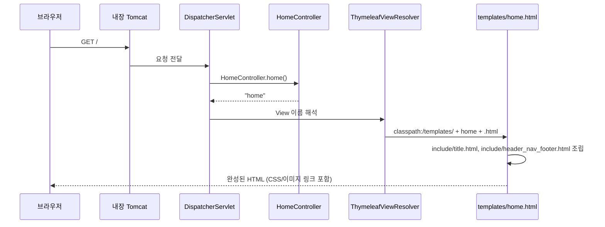

# calendar 프로젝트 전체 시스템 해석본

## 이 문서의 목적

`spring_sts3/Pjt/BookRentalPjt/00_SYSTEM_OVERVIEW.md`와 같은 목적의 문서입니다.
`calendar`가 Spring Boot에서 어떻게 시작되고, 요청이 어떤 파일들을 거쳐 화면과
DB 결과로 이어지는지 전체 지도를 그립니다. Legacy와의 구조적 차이는
`../../01_LEGACY_VS_BOOT.md`(springboot_intellij/Pjt 루트)에서 이미 다뤘으므로,
이 문서는 `calendar` 자체의 동작에 집중합니다.

```text
브라우저 요청
  -> 내장 Tomcat
  -> DispatcherServlet (자동 등록)
  -> Controller
  -> Service
  -> DAO / Mapper / Repository (세 가지 병행)
  -> MySQL DB
  -> Model/Session
  -> Thymeleaf 템플릿과 정적 리소스
  -> 브라우저 화면
```

## 1. 이 프로젝트가 하는 일 (현재까지)

`calendar`는 이름 그대로 캘린더/일정 관리 서비스를 목표로 하는 것으로 보이지만,
**현재 구현되어 있는 것은 회원(Member) 기능뿐**입니다.

```text
구현 완료
  회원가입, 로그인, 로그아웃, 계정 수정, 비밀번호 찾기(메일 발송)

준비만 되어 있고 미구현
  Planner(일정) 기능 — 메뉴 링크와 CSS(planner.css)는 있지만
  Controller/Service/DAO/템플릿이 전혀 없음 (17_VIEW_LAYER.md 7절 참고)
```

## 2. 실행 준비물 (build.gradle)

[build.gradle](02_build.gradle-해석본.md)이 Thymeleaf, Web MVC, JDBC, MySQL 드라이버,
Security, Mail, Log4j2, MyBatis, JPA까지 한 프로젝트에 모두 모아 두었습니다.
MyBatis와 JPA가 동시에 있다는 것은 이 프로젝트가 "정답 코드 하나"가 아니라
"데이터 접근 기술 비교 학습용"이라는 뜻입니다.

## 3. 애플리케이션이 시작되는 순서

```text
1. ./gradlew bootRun (또는 IDE의 main() 실행)
2. CalendarApplication.main() 실행
3. @SpringBootApplication 이 com.office.calendar 이하 전체를 component-scan
4. application.properties를 읽어 자동 설정 적용
     - DataSource, JdbcTemplate (spring.datasource.*)
     - Thymeleaf ViewResolver (spring.thymeleaf.*)
     - JavaMailSender (spring.mail.*)
     - MyBatis SqlSessionFactory (mybatis.*)
     - JPA EntityManagerFactory (spring.jpa.*)
     - Log4j2 로깅 (logging.config)
5. WebConfig가 MemberSigninInterceptor를 /member/modify에 등록
6. SecurityConfig가 PasswordEncoder Bean 등록, 폼 로그인/CSRF/CORS 비활성화
7. 내장 Tomcat이 8090 포트로 기동, 요청 수신 시작
```

`BookRentalPjt`처럼 "web.xml -> servlet-context.xml -> 개별 XML" 순서로 여러
파일을 따라가며 확인할 필요 없이, 이 순서 전체가 `application.properties` +
`CalendarApplication` + Java Config 클래스 두 개로 파악됩니다.

## 4. 첫 화면 실행 흐름



`BookRentalPjt`와 달리 `HomeController`가 redirect 없이 곧바로 뷰 이름을
반환합니다(자세한 비교는 [05_HomeController.java-해석본.md](05_HomeController.java-해석본.md)).

## 5. 회원 기능 전체 구조

회원가입/로그인/계정수정/비밀번호찾기의 세부 흐름과, 이 도메인이 세 가지
데이터 접근 방식(JdbcTemplate DAO / MyBatis Mapper / JPA Repository)으로
나란히 구현된 비교는 [06_MEMBER_FLOW.md](06_MEMBER_FLOW.md)에서 다룹니다.

## 6. 계층별 역할

### Controller — [MemberController.java](07_MemberController.java-해석본.md)

URL과 Java 메서드를 연결하고, Session과 Model을 다룹니다. SQL을 직접 작성하지
않는 것은 Legacy와 동일한 원칙입니다.

### Service — [MemberService.java](08_MemberService.java-해석본.md)

비밀번호 암호화, 중복 검사, 새 비밀번호 생성 같은 업무 규칙을 처리합니다.
이 프로젝트에서는 **어떤 데이터 접근 계층을 호출할지 선택하는 지점**이기도 합니다
(현재는 `MemberRepository`만 실제로 호출).

### DAO / Mapper / Repository

같은 `USER_MEMBER` 테이블에 접근하는 세 가지 구현체입니다.

```text
MemberDao         JdbcTemplate, SQL을 Java 문자열로 직접 작성 (미사용)
MemberMapper      MyBatis, SQL을 XML에 작성 (미사용)
MemberRepository  Spring Data JPA, SQL 없이 메서드 이름/Entity로 처리 (사용 중)
```

### DTO / Entity

`MemberDto`(계층 간 데이터 운반)와 `MemberEntity`(JPA가 관리하는 테이블 매핑
객체)가 분리되어 있고, `toEntity()`/`toDto()`로 서로 변환합니다.

### Interceptor — [MemberSigninInterceptor.java](16_MemberSigninInterceptor.java-해석본.md)

Controller보다 먼저 실행되어 Session의 로그인 여부를 확인합니다. Legacy의
`HandlerInterceptor` 코드와 완전히 동일한 인터페이스를 그대로 재사용합니다.

### Configuration — [SecurityConfig.java](14_SecurityConfig.java-해석본.md), [WebConfig.java](15_WebConfig.java-해석본.md)

DB/Mail처럼 자동 설정되지 않는, 직접 정의가 필요한 Bean(PasswordEncoder,
SecurityFilterChain, Interceptor 등록)을 담당합니다. Legacy의 XML Bean 정의를
Java 코드로 옮긴 지점입니다.

## 7. 이 프로젝트를 읽는 순서

1. [build.gradle](02_build.gradle-해석본.md): 어떤 기술을 함께 쓰는지 확인 (MyBatis + JPA 동시 사용에 주목)
2. [application.properties](03_application.properties-해석본.md): DB, Mail, Thymeleaf, 로깅 설정 한눈에 확인
3. [CalendarApplication.java](04_CalendarApplication.java-해석본.md): 실행 진입점
4. [HomeController.java](05_HomeController.java-해석본.md): 첫 화면 흐름
5. [06_MEMBER_FLOW.md](06_MEMBER_FLOW.md): 회원가입/로그인/수정/비밀번호찾기 전체 흐름과 3가지 데이터 접근 방식 비교
6. [MemberController.java](07_MemberController.java-해석본.md) → [MemberService.java](08_MemberService.java-해석본.md) → [MemberDao.java](09_MemberDao.java-해석본.md) / [MemberMapper.java](10_MemberMapper.java-해석본.md) / [MemberRepository.java](11_MemberRepository.java-해석본.md): 계층별 상세
7. [MemberEntity.java](12_MemberEntity.java-해석본.md), [MemberDto.java](13_MemberDto.java-해석본.md): 데이터 표현과 변환
8. [SecurityConfig.java](14_SecurityConfig.java-해석본.md), [WebConfig.java](15_WebConfig.java-해석본.md), [MemberSigninInterceptor.java](16_MemberSigninInterceptor.java-해석본.md): 인증/보안 배선
9. [17_VIEW_LAYER.md](17_VIEW_LAYER.md): Thymeleaf 템플릿, CSS, JS
10. [log4j2.xml](18_log4j2.xml-해석본.md), [mybatis-config.xml](19_mybatis-config.xml-해석본.md), [member-mapper.xml](20_member-mapper.xml-해석본.md): 부가 설정 파일

## 8. 현재 코드에서 확인되는 중요한 주의점 (요약)

이 항목들은 각 파일별 해석본에서 상세히 다룬 내용을 한 곳에 모은 것입니다.

- **[MemberDto.toEntity()](13_MemberDto.java-해석본.md)에 `phone` 매핑이 빠져 있습니다.** 회원가입 시
  `USER_MEMBER.PHONE`(NOT NULL)이 항상 비워진 채로 저장을 시도하게 되는 경로입니다.
- **[MemberService.sendNewPasswordByMail()](08_MemberService.java-해석본.md)이 실제 수신자
  파라미터를 무시하고 고정 메일 주소로만 발송합니다.**
- **[WebConfig](15_WebConfig.java-해석본.md)의 로그인 보호 범위가 `/member/modify`(GET) 하나뿐**이라,
  실제로 데이터를 바꾸는 `/member/modify_confirm`(POST)은 로그인 검사 없이 호출 가능합니다.
- **`MemberDao`, `MemberMapper`는 Bean으로 등록되어 있지만 `MemberService`에서 호출되지
  않는 죽은 코드**입니다. 세 가지 데이터 접근 방식을 비교하기 위해 의도적으로 남겨둔 것으로
  보이나, 실제 서비스 코드라면 정리 대상입니다.
- **[nav의 `/planner` 링크와 `planner.css`가 이미 존재하지만 Controller/템플릿이 없어
  404가 발생합니다](17_VIEW_LAYER.md).** 다음 학습 단계로 예정된 기능의 뼈대로 보입니다.
- DB 계정과 메일 계정 정보가 `application.properties`에 평문으로 작성되어 있습니다
  (STS3 `BookRentalPjt`에서도 동일하게 관찰된 패턴).
- `HomeController`는 `@Slf4j` 기반 로깅을, `MemberController`/`MemberService`/`MemberDao`는
  `System.out.println` 기반 로깅을 사용해 파일마다 로깅 방식이 통일되어 있지 않습니다.

## 9. 이 프로젝트를 직접 설명할 수 있는 기준

```text
1. CalendarApplication의 main()이 실행되는 순간, Tomcat은 언제 함께 뜨는가?
2. application.properties의 spring.datasource.* 네 줄만으로 JdbcTemplate이 동작하는 이유는?
3. MemberDao, MemberMapper, MemberRepository는 각각 같은 SQL을 어떤 방식으로 표현하는가?
4. modifyConfirm()이 save()를 호출하지 않는데도 DB가 바뀌는 이유는? (@Transactional, Dirty Checking)
5. SecurityConfig가 formLogin을 꺼두었는데 로그인은 실제로 무엇이 처리하는가?
6. MemberSigninInterceptor는 어떤 URL에서만 동작하며, 그 범위가 왜 충분하지 않은가?
7. th:replace와 JSP의 jsp:include는 개념적으로 무엇이 같고 무엇이 다른가?
8. planner 관련 코드가 준비되어 있는데도 동작하지 않는 이유는?
```
