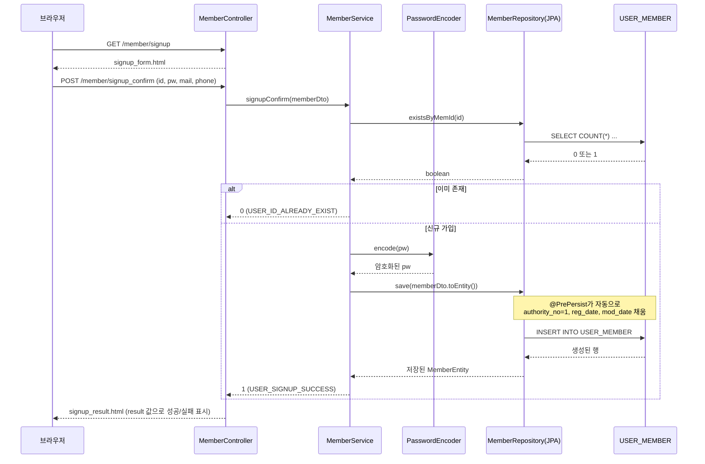

# 회원(Member) 기능 전체 흐름

## 이 문서의 목적

`calendar` 프로젝트에서 유일하게 구현된 도메인인 Member 기능의 요청-응답 흐름을
정리하고, 이 도메인이 세 가지 데이터 접근 방식(DAO/Mapper/Repository)으로 어떻게
나란히 구현되어 있는지 비교합니다.

## 1. 회원가입



## 2. 로그인과 Session, Interceptor의 관계

```text
signin_form.html
  -> POST /member/signin_confirm
  -> MemberController.signinConfirm()
  -> MemberService.signinConfirm()
     -> MemberRepository.findByMemId()
     -> passwordEncoder.matches(입력값, DB값)
  -> 성공: session.setAttribute("loginedID", id) + 30분 유효시간
  -> signin_result.html
```

이후 `/member/modify`에 접근하면:

```text
GET /member/modify
  -> WebConfig가 등록한 MemberSigninInterceptor.preHandle() 먼저 실행
     -> session.getAttribute("loginedID") 확인
     -> 있으면 true(통과), 없으면 /member/signin으로 redirect
  -> 통과 시 MemberController.modify() 실행
     -> memberService.modify(loginedID)
     -> MemberRepository.findByMemId() -> memberEntity.toDto()
  -> modify_form.html (기존 값이 채워진 폼)
```

**주의**: 위 보호는 `GET /member/modify`(폼 화면)에만 적용되고, 실제 DB를 바꾸는
`POST /member/modify_confirm`에는 적용되지 않습니다. 자세한 내용은
[15_WebConfig.java-해석본.md](15_WebConfig.java-해석본.md)의 주의점을 참고하십시오.

## 3. 계정 수정과 JPA 변경 감지

```text
modify_form.html (no는 hidden, id는 readonly)
  -> POST /member/modify_confirm
  -> MemberController.modifyConfirm()
  -> MemberService.modifyConfirm()  [@Transactional]
     -> passwordEncoder.encode(새 pw)
     -> memberRepository.findById(no)
     -> Entity의 필드를 setter로 직접 변경 (save() 호출 없이도 반영됨: Dirty Checking)
  -> modify_result.html
```

## 4. 비밀번호 찾기와 메일 발송

```text
findpassword_form.html (id, mail 입력)
  -> POST /member/findpassword_confirm
  -> MemberController.findpasswordConfirm()
  -> MemberService.findpasswordConfirm()
     -> memberRepository.findByMemIdAndMemMail(id, mail)  본인 인증
     -> createNewPassword()  8자리 랜덤 비밀번호 생성
     -> passwordEncoder.encode() 후 memberRepository.save()
     -> sendNewPasswordByMail()  (주의: 현재 수신자가 고정 주소로 하드코딩됨)
  -> findpassword_result.html
```

## 5. 같은 기능, 세 가지 데이터 접근 방식 비교표

| 동작 | MemberDao (JdbcTemplate) | MemberMapper (MyBatis) | MemberRepository (JPA) — 현재 사용 중 |
|---|---|---|---|
| ID 중복 확인 | `SELECT COUNT(*)...` 문자열 SQL | XML의 `<select id="isMember">` | `existsByMemId()` 메서드 이름만으로 쿼리 생성 |
| 회원 저장 | `INSERT INTO ...` + `jdbcTemplate.update()` | XML의 `<insert id="insertMember">` | `save(memberDto.toEntity())`, `@PrePersist`가 등록일 자동 채움 |
| ID로 조회 | `BeanPropertyRowMapper`로 결과 -> DTO 변환 | `resultType="MemberDto"`로 자동 변환 | `findByMemId()` -> `Optional<MemberEntity>` -> `toDto()` |
| 정보 수정 | `UPDATE ...` 문자열 SQL 직접 실행 | XML의 `<update id="updateMember">` | Entity의 setter만 호출, `@Transactional`이 자동 UPDATE 실행 |
| SQL의 위치 | Java 코드 안 (문자열) | 별도 XML 파일 | 없음 (Hibernate가 생성) |
| 실제 사용 여부 | 사용 안 함 (주석 처리) | 사용 안 함 (주석 처리) | **실제로 사용 중** |

`MemberDao`, `MemberMapper`는 완성된 채로 남아 있지만 `MemberService`에서 호출되지
않는 "죽은 코드"입니다. 세 가지 기술을 한 도메인(Member)에 나란히 구현해 두고
직접 비교해 보는 것이 이 프로젝트의 학습 목적이며, 실제 서비스 코드였다면
하나만 남기고 나머지 두 계층은 삭제하는 것이 맞는 정리 방향입니다.
